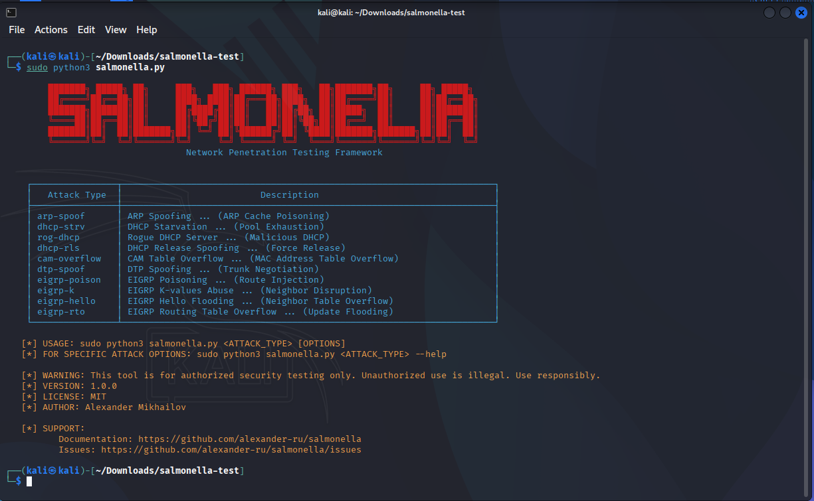
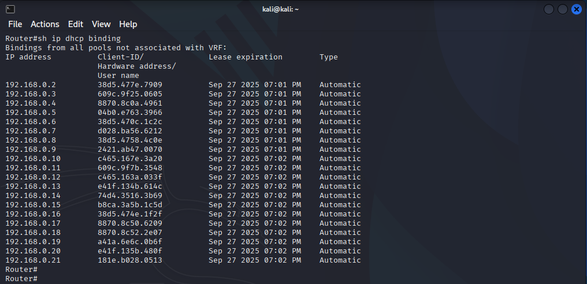
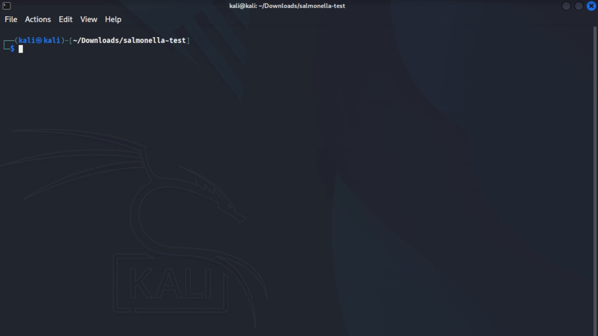
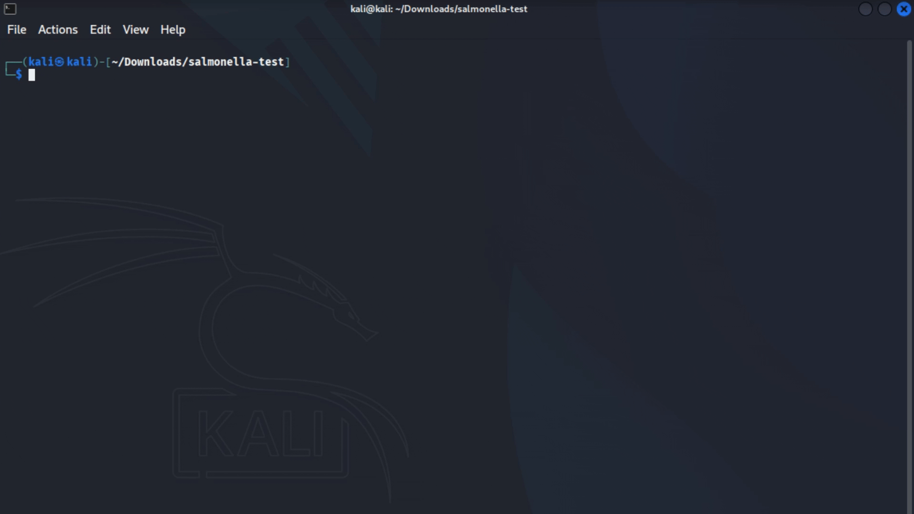
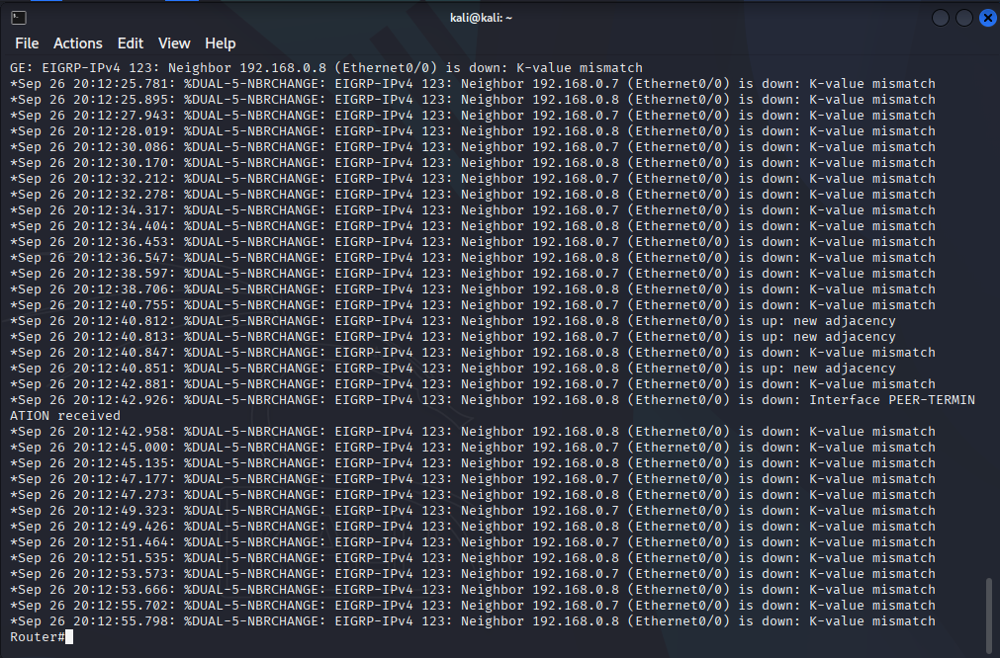
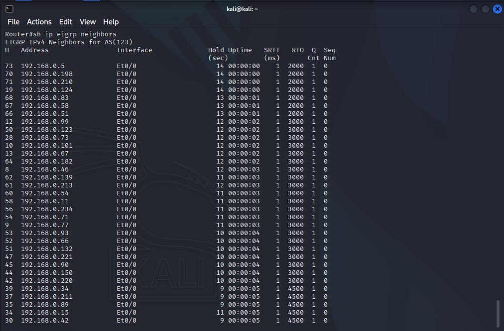
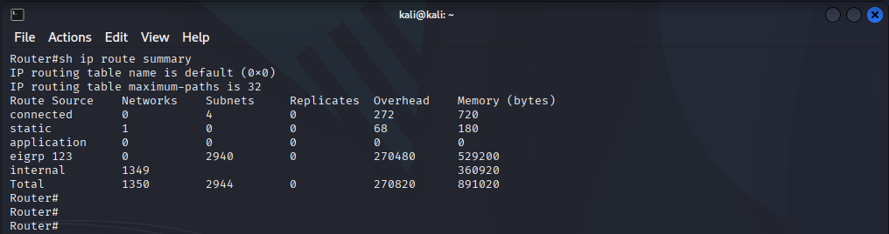
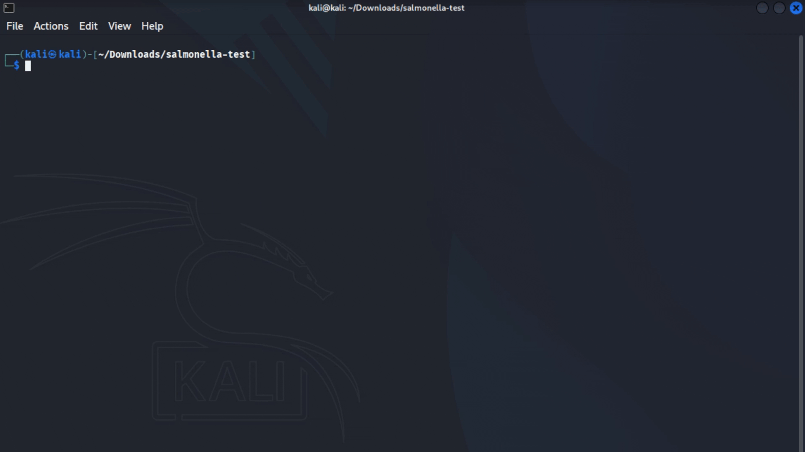

# 🦠 Salmonella - Network Penetration Testing Framework


##  [EN](#en)

## <a name="#ru">📌 Содержание</a>
- [Введение](#Введение)
- [Возможности](#Возможности)
- [Предупреждение](#Предупреждение)
- [Установка](#Установка)
- [Использование](#Использование)
  - [DHCP Starvation](#dhcp-strv)
  - [Rogue DHCP](#rog-dhcp)
  - [DHCP Release Spoofing](#dhcp-rls)
  - [ARP Spoofing](#arp-spoof)
  - [EIGRP Poisoning](#eigrp-poison)
  - [EIGRP Abusing K-values](#eigrp-k)
  - [EIGRP Hello Flooding](#eigrp-hello)
  - [EIGRP Routing Table Overflow](#eigrp-rto)
  - [DTP Spoofing](#dtp-spoof)
  - [CAM Table Overflow](#cam-overflow)
- [Лицензия](#Лицензия)

## <a name="Введение">📝 Введение</a>
**Salmonella** - твой патоген против иммунной системы компьютерных сетей. Инструмент представляет 
собой сетевой атакующий фреймворк, реализованный на Python, который позволяет проводить 
стресс-тестирование и анализ уязвимостей ключевых сетевых протоколов.
- **Для кого?** Утилита предназначена для специалистов по кибербезопасности, энтузиастов Red Team, 
студентов, изучающих сетевые технологии, и администраторов, желающих протестировать 
устойчивость своей инфраструктуры.
- **Для чего?** Разработана для проведения учебных упражнений в контролируемых лабораторных средах, 
тестирования на проникновение и исследования уязвимостей сетевых протоколов.  

Присоединяйся к разработке! Я буду рад идеям по новым функциям и сообщениям об ошибках в **Issues**.

## <a name="Возможности">🔥 Возможности
- **ARP Spoofing** (отравление ARP-кэша)
- **DHCP**
  - **DHCP Release Spoofing** (освобождение пула)
  - **DHCP Starvation** (исчерпание пула)
  - **Rogue DHCP** (развертывание поддельного DHCP-сервера)
- **EIGRP**
  - **EIGRP Poisoning** (отравление таблицы маршрутизации)
  - **EIGRP Abusing K-values** (манипуляция коэффициентами)
  - **EIGRP Hello Flooding** (переполнение таблицы соседей)
  - **EIGRP Routing Table Overflow** (переполнение таблицы маршрутизации)
- **DTP Spoofing** (согласование транкового канала)
- **CAM Table Overflow** (переполнение CAM-таблицы)

## <a name="Предупреждение">⚠ Предупреждение
**ВНИМАНИЕ**: Используй только в законных целях и с явного разрешения владельца сети. 
 Автор не несёт ответственности за любой вред, причиненный при помощи данной утилиты. 
 Распространение вредоносных программ, нарушение работы систем и нарушение тайны переписки 
 преследуются по закону.

## <a name="Установка">📦 Установка</a>
1. Убедись, что у тебя установлен **Python** актуальной версии
2. Клонируй репозиторий:

   ```bash
   git clone https://github.com/alexander-ru/salmonella.git
3. Перейди в директорию ```.../salmonella``` и установи зависимости:

    ```bash
   pip install -r requirements.txt
4. Начинай пользоваться:

    ```bash
    python salmonella.py --help

## <a name="Использование">🚀 Использование</a>
```bash
sudo python3 salmonella.py <ТИП_АТАКИ> [ПАРАМЕТРЫ]
```



❗ Рекомендация: Если ты используешь ОС Windows - явно указывай нужный интерфейс через параметр  
```--intf```, а остальные - отключи! Это нужно для корректной работы Salmonella.

### <a name="dhcp-strv">DHCP Starvation</a>
```bash
sudo python3 salmonella.py dhcp-strv [-h] [--cnt ] [--ip ] [--intv ] [--intf ]
```
```bash
  -h, --help  show this help message and exit
  --cnt       Number of DHCP Discover packets (default 254)
  --ip        IP address of the DHCP server (default any)
  --intv      The interval for sending DISCOVER packets (seconds)
  --intf      Your network interface
```



### <a name="rog-dhcp">Rogue DHCP</a>
```bash
sudo python3 salmonella.py rog-dhcp [-h] --ip  --mask  --start  --end  --gtw  --dns  [--lease ] --domain  [--intf ]
```
```bash
  -h, --help  show this help message and exit
  --ip        IP address of Rogue DHCP server
  --mask      Subnet mask
  --start     The first IP address from the pool (e.g. 10.10.10.2)
  --end       Last IP address from the pool (e.g. 10.10.10.254)
  --gtw       The default gateway for clients
  --dns       DNS server address for clients
  --lease     Lease time (seconds)(default 86400)
  --domain    Domain name
  --intf      Your network interface
```


### <a name="dhcp-rls">DHCP Release Spoofing</a>
```bash
sudo python3 salmonella.py dhcp-rls [-h] --start  --end  --dhcp  [--intf ]
```
```bash
  -h, --help  show this help message and exit
  --start     The first IP address from the pool (e.g. 10.10.10.2)
  --end       Last IP address from the pool (e.g. 10.10.10.254)
  --dhcp      IP address of legitimate DHCP server
  --intf      Your network interface
```


### <a name="arp-spoof">ARP Spoofing</a>
❗ Перед тем как использовать атаку ARP Spoofing включи функцию ```IP Forwarding```, чтобы
твое устройство могло маршрутизировать трафик жертвы:  
```bash
echo 1 > /proc/sys/net/ipv4/ip_forward
```
❗❗ Кроме того, если ты используешь ОС Windows, то настоятельно рекомендую на своем устройстве
прописать статическую ARP запись для IP и MAC адреса твоего шлюза по умолчанию.
```bash
sudo python3 salmonella.py arp-spoof [-h] --vic  --gtw  [--intf ]
```
```bash
  -h, --help  show this help message and exit
  --vic       Victim's IP address
  --gtw       Gateway IP address
  --intf      Your network interface
```


### <a name="eigrp-poison">EIGRP Poisoning</a>
```bash
sudo python3 salmonella.py eigrp-poison [-h] --net  --pref  [--nh ] [--intf ] [-i] [-e]
```
```bash
  -h, --help      show this help message and exit
  --net           Destination network
  --pref          Prefix (e.g. 24)
  --nh            IP address of next hop (0.0.0.0 for your device or other)
  --intf          Your network interface
  -i, --internal  Use this flag if you want to utilize INTERNAL EIGRP routes (default)
  -e, --external  Use this flag if you want to utilize EXTERNAL EIGRP routes
```
Пример использования с несколькими маршрутами:
```bash
sudo python3 salmonella.py eigrp-poison --net 10.10.10.0_192.168.1.0 --pref 24_25 --nh 0.0.0.0_0.0.0.0
```
❗ Значения аргументов ```--net```, ```--pref``` и ```--nh``` разделяются нижним подчеркиванием ```_```.  
❗❗ Количество значений в аргументах ```--net```, ```--pref``` и ```--nh``` должно совпадать.


### <a name="eigrp-k">EIGRP Abusing K-values</a>
```bash
sudo python3 salmonella.py salmonella.py eigrp-k [-h] [--intf ]
```
```bash
  -h, --help  show this help message and exit
  --intf      Your network interface
```



### <a name="eigrp-hello">EIGRP Hello Flooding</a>
```bash
sudo python3 salmonella.py eigrp-hello [-h] [--intf ]
```
```bash
  -h, --help  show this help message and exit
  --intf      Your network interface
```



### <a name="eigrp-rto">EIGRP Routing Table Overflow</a>
```bash
sudo python3 salmonella.py eigrp-rto [-h] [--intf ]
```
```bash
  -h, --help  show this help message and exit
  --intf      Your network interface
```




### <a name="dtp-spoof">DTP Spoofing</a>
```bash
sudo python3 salmonella.py dtp-spoof [-h] [--intf ]
```
```bash
  -h, --help  show this help message and exit
  --intf      Your network interface
```


### <a name="cam-overflow">CAM Table Overflow</a>
```bash
sudo python3 salmonella.py cam-overflow [-h] [--intf ]
```
```bash
  -h, --help  show this help message and exit
  --intf      Your network interface
```


## <a name="Лицензия">📜 Лицензия</a>
MIT License. Полный текст доступен в файле [LICENSE](LICENSE)


# <a name="en">🦠 Salmonella - Network Penetration Testing Framework


## 📌 Contents
- [Introduction](#Introduction)
- [Features](#Features)
- [Warning](#Warning)
- [Installation](#Installation)
- [Usage](#Usage)
  - [DHCP Starvation](#dhcp-strv-en)
  - [Rogue DHCP](#rog-dhcp-en)
  - [DHCP Release Spoofing](#dhcp-rls-en)
  - [ARP Spoofing](#arp-spoof-en)
  - [EIGRP Poisoning](#eigrp-poison-en)
  - [EIGRP Abusing K-values](#eigrp-k-en)
  - [EIGRP Hello Flooding](#eigrp-hello-en)
  - [EIGRP Routing Table Overflow](#eigrp-rto-en)
  - [DTP Spoofing](#dtp-spoof-en)
  - [CAM Table Overflow](#cam-overflow-en)
- [License](#License)

## <a name="Introduction">📝 Introduction</a>
Salmonella is your pathogen against the immune system of computer networks. This tool is a 
network attack framework implemented in Python, designed for stress testing and vulnerability 
analysis of key network protocols.
- For whom? The utility is intended for cybersecurity specialists, Red Team enthusiasts, 
students learning network technologies, and administrators looking to test the resilience 
of their infrastructure.
- For what purpose? Developed for conducting training exercises in controlled lab 
environments, penetration testing, and researching vulnerabilities in network protocols.

Join the development! I welcome ideas for new features and bug reports in the **Issues** section.

## <a name="Features">🔥 Features</a>
- **ARP Spoofing** (ARP cache poisoning)
- **DHCP**
  - **DHCP Release Spoofing** (depleting the address pool)
  - **DHCP Starvation** (exhausting the address pool)
  - **Rogue DHCP** (deploying a fake DHCP server)
- **EIGRP**
  - **EIGRP Poisoning** (routing table poisoning)
  - **EIGRP Abusing K-values** (manipulating metrics)
  - **EIGRP Hello Flooding** (overwhelming the neighbor table)
  - **EIGRP Routing Table Overflow** (overflowing the routing table)
- **DTP Spoofing** (trunk negotiation spoofing)
- **CAM Table Overflow** (overflowing the CAM table)

## <a name="Warning">⚠ Warning</a>
**WARNING**: Use only for legitimate purposes and with explicit permission from the network owner.
The author is not responsible for any damage caused by this utility.
Distribution of malware, disruption of systems, and violation of communication privacy are 
punishable by law.

## <a name="Installation">📦 Installation</a>
1. Ensure you have the latest version of **Python** installed.
2. Clone the repository:

   ```bash
   git clone https://github.com/alexander-ru/salmonella.git
   
3. Navigate to the .../salmonella directory and install the dependencies:

   ```bash
   pip install -r requirements.txt

4. Start using it:

   ```bash
   python salmonella.py --help
   
## <a name="Usage">🚀 Usage</a>

```bash
sudo python3 salmonella.py <ATTACK_TYPE> [PARAMETERS]
```


❗ Recommendation: If you are using a Windows OS, explicitly specify the desired interface 
using the ```--intf``` parameter and disable all others! This is necessary for 
Salmonella to work correctly.

### <a name="dhcp-strv-en">DHCP Starvation</a>

```bash
sudo python3 salmonella.py dhcp-strv [-h] [--cnt ] [--ip ] [--intv ] [--intf ]
```
```bash
  -h, --help  show this help message and exit
  --cnt       Number of DHCP Discover packets (default 254)
  --ip        IP address of the DHCP server (default any)
  --intv      The interval for sending DISCOVER packets (seconds)
  --intf      Your network interface
```


### <a name="rog-dhcp-en">Rogue DHCP</a>
```bash
sudo python3 salmonella.py rog-dhcp [-h] --ip  --mask  --start  --end  --gtw  --dns  [--lease ] --domain  [--intf ]
```
```bash
  -h, --help  show this help message and exit
  --ip        IP address of Rogue DHCP server
  --mask      Subnet mask
  --start     The first IP address from the pool (e.g. 10.10.10.2)
  --end       Last IP address from the pool (e.g. 10.10.10.254)
  --gtw       The default gateway for clients
  --dns       DNS server address for clients
  --lease     Lease time (seconds)(default 86400)
  --domain    Domain name
  --intf      Your network interface
```


### <a name="dhcp-rls-en">DHCP Release Spoofing</a>
```bash
sudo python3 salmonella.py dhcp-rls [-h] --start  --end  --dhcp  [--intf ]
```
```bash
  -h, --help  show this help message and exit
  --start     The first IP address from the pool (e.g. 10.10.10.2)
  --end       Last IP address from the pool (e.g. 10.10.10.254)
  --dhcp      IP address of legitimate DHCP server
  --intf      Your network interface
```


### <a name="arp-spoof-en">ARP Spoofing</a>
❗ Before using the ARP Spoofing attack, enable ```IP Forwarding``` so that your device can route 
the victim's traffic:  
```bash
echo 1 > /proc/sys/net/ipv4/ip_forward
```
❗❗ Furthermore, if you are using a Windows OS, it is highly recommended to set a static ARP entry 
on your device for the IP and MAC address of your default gateway.

```bash
sudo python3 salmonella.py arp-spoof [-h] --vic  --gtw  [--intf ]
```
```bash
  -h, --help  show this help message and exit
  --vic       Victim's IP address
  --gtw       Gateway IP address
  --intf      Your network interface
```


### <a name="eigrp-poison-en">EIGRP Poisoning</a>
```bash
sudo python3 salmonella.py eigrp-poison [-h] --net  --pref  [--nh ] [--intf ] [-i] [-e]
```
```bash
  -h, --help      show this help message and exit
  --net           Destination network
  --pref          Prefix (e.g. 24)
  --nh            IP address of next hop (0.0.0.0 for your device or other)
  --intf          Your network interface
  -i, --internal  Use this flag if you want to utilize INTERNAL EIGRP routes (default)
  -e, --external  Use this flag if you want to utilize EXTERNAL EIGRP routes
```
Usage example with multiple routes:
```bash
sudo python3 salmonella.py eigrp-poison --net 10.10.10.0_192.168.1.0 --pref 24_25 --nh 0.0.0.0_0.0.0.0
```
❗ The values for the ```--net```, ```--pref```, and ```--nh``` arguments are separated by an underscore ```_```.  
❗❗ The number of values in the ```--net```, ```--pref```, and ```--nh``` arguments must match.


### <a name="eigrp-k-en">EIGRP Abusing K-values</a>
```bash
sudo python3 salmonella.py salmonella.py eigrp-k [-h] [--intf ]
```
```bash
  -h, --help  show this help message and exit
  --intf      Your network interface
```


### <a name="eigrp-hello-en">EIGRP Hello Flooding</a>
```bash
sudo python3 salmonella.py eigrp-hello [-h] [--intf ]
```
```bash
  -h, --help  show this help message and exit
  --intf      Your network interface
```


### <a name="eigrp-rto-en">EIGRP Routing Table Overflow</a>
```bash
sudo python3 salmonella.py eigrp-rto [-h] [--intf ]
```
```bash
  -h, --help  show this help message and exit
  --intf      Your network interface
```


### <a name="dtp-spoof-en">DTP Spoofing</a>
```bash
sudo python3 salmonella.py dtp-spoof [-h] [--intf ]
```
```bash
  -h, --help  show this help message and exit
  --intf      Your network interface
```


### <a name="cam-overflow-en">CAM Table Overflow</a>
```bash
sudo python3 salmonella.py cam-overflow [-h] [--intf ]
```
```bash
  -h, --help  show this help message and exit
  --intf      Your network interface
```


## <a name="License">📜 License</a>
MIT License. The full text is available in the [LICENSE](LICENSE) file.
